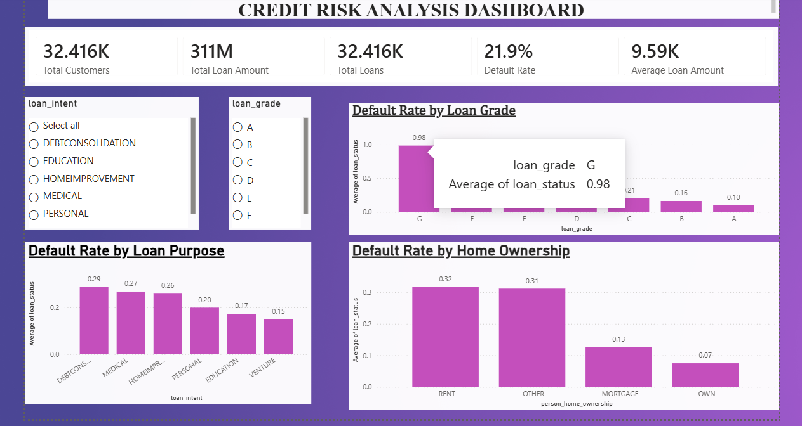
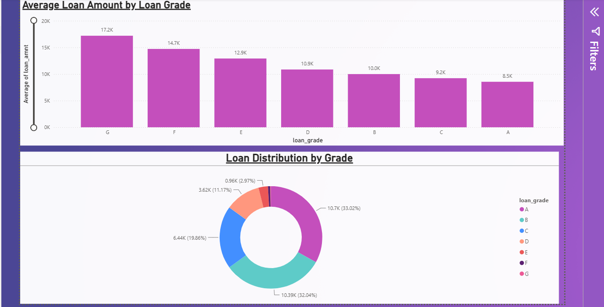
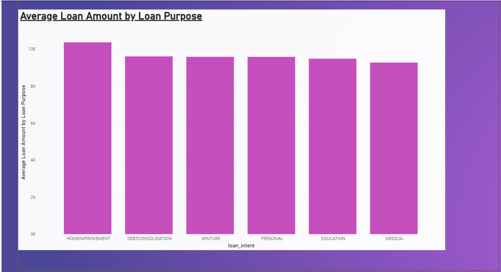

# Credit Risk Analysis

## 📌 Project Overview

This project analyzes borrower and loan data to identify factors associated with loan defaults and assess overall credit risk.

The project combines **MySQL, SQL, and Power BI** to perform data analysis and create an interactive credit risk dashboard.

## 🎯 Objectives

- Analyze loan default patterns
- Identify high-risk borrower segments
- Examine the relationship between loan amount and default risk
- Analyze default rates by loan grade, loan intent, home ownership, and employment length
- Build an interactive Power BI dashboard for credit risk monitoring

## 🛠️ Tools & Technologies

- MySQL
- SQL
- Power BI
- Microsoft Excel / CSV
- Data Cleaning
- Data Analysis
- Data Visualization

## 📊 Dataset

The dataset contains **32,581 loan records** with information including:

- Person income
- Age
- Home ownership
- Employment length
- Loan amount
- Loan intent
- Loan interest rate
- Loan grade
- Loan-to-income percentage
- Previous credit default
- Loan status

## 🔍 Key Findings

- Overall loan default rate is approximately **21.82%**
- Higher loan-to-income ratios are strongly associated with higher default rates
- Lower loan grades show substantially higher default risk
- Renters have a higher default rate than homeowners and mortgage holders
- Shorter employment histories are associated with higher default rates
- Larger loan amounts generally show higher default risk

## 📈 Power BI Dashboard

The dashboard provides interactive analysis of:

- Overall loan portfolio
- Default rate
- Loan amount distribution
- Default rates by loan grade
- Default rates by loan-to-income ratio
- Default rates by home ownership
- Default rates by employment length
- Loan intent analysis

### Dashboard Page 1

### Dashboard Page 2

### Dashboard Page 3

## 🗄️ SQL Analysis

SQL was used for data exploration, cleaning, aggregation, and identifying high-risk borrower segments.

The SQL queries used for the analysis are available in the **SQL** section of this repository.

## 💡 Business Recommendations

- Closely monitor borrowers with high loan-to-income ratios
- Apply stricter risk assessment to lower loan grades
- Monitor applicants with limited employment history
- Pay additional attention to borrower segments with historically high default rates
- Use dashboard insights to support data-driven credit decisions

## 📁 Project Files

- `credit_risk_dataset.csv` — Dataset
- SQL file — Data analysis queries
- `.pbix` file — Power BI dashboard
- Dashboard screenshots — Visual representation of the analysis

## 👩‍💻 Project Skills Demonstrated

**SQL | MySQL | Power BI | Data Cleaning | Exploratory Data Analysis | Data Visualization | Business Analysis | Credit Risk Analysis**
